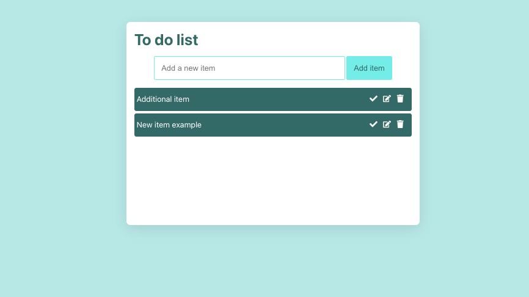

# To do list 

This is a project I created to practice my React skills. I worked on this project outside of the online courses I was doing. 

## Overview

My aim was to create a to do list where the user can add, delete and edit the tasks on their list. The list is also mobile friendly. 

## Built with

- HTML5
- CSS3
- Javascript
- React

### Screenshot 

### Link

- URL: [https://ojknox.github.io/Todo-list/](https://ojknox.github.io/Todo-list/)
